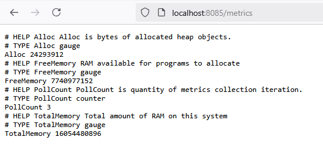
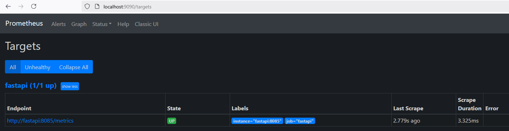
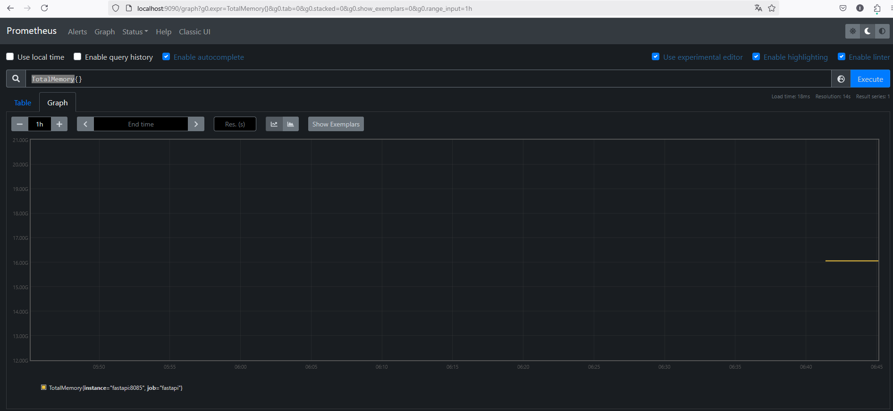

# Kafka-Connect
Итоговый проект третьего модуля

## Задание 1. Оптимизация параметров для повышения пропускной способности JDBC Source Connector

1. Установим параметр batch.size по формуле (по умолчанию равно 16384 байта).
Конфигурация batch.size должна быть пропорциональна количеству записей, возвращаемых коннектором batch.max.rows. Её устанавливают по формуле:
batch.size = batch.max.rows * record_size_average_in_bytes
При конфигурировании коннектора мы установили batch.max.rows равным 100.
Посмотрим на график Record Size Average (528B).
В итоге получаем следующее:
batch.size = 100 * 528 = 52800
Переконфигурируем коннектор, удалим все данные в БД (выполнив TRUNCATE users), и заново запишем 9 000 000 строк в PostgreSQL.

2. Конфигурация параметра linger.ms зависит от количества записей. Например, если возвращается 10 записей, подойдёт значение 5 мс. Если записей 100 000, то для заполнения пачки данных требуется больше времени, а значит, linger.ms нужно увеличить.
Если linger.ms мало, то может возникнуть ситуация, когда запросов слишком много, и пачки данных не успевают заполниться достаточным количеством записей. С другой стороны, если linger.ms велико, то ожидание может быть чересчур большим, а отправка пачек данных — слишком медленной.

3. Параметр compression.type позволяет активировать сжатие сообщений перед их отправкой. По умолчанию сообщения передаются в несжатом виде. Сжатие может снизить нагрузку на сеть и хранилище, которые часто становятся узкими местами при отправке сообщений в Kafka.
Возможные значения параметра:
 - snappy. Алгоритм разработан компанией Google. Он обеспечивает хорошую степень сжатия при низком потреблении ресурсов CPU и высокой производительности. Поэтому его часто используют, когда важны и производительность, и пропускная способность сети.
 - gzip Алгоритм требует больше ресурсов CPU и времени, но обеспечивает лучшую степень сжатия. Этот алгоритм выбирают, когда пропускная способность сети ограничена.
 - lz4 и zstd — ещё два алгоритма, задающих способ сжатия.

4. Конфигурация параметра buffer.memory определяет общее количество байт памяти, которое можно использовать для буферизации записей, ожидающих отправки на сервер. Например, брокер Kafka недоступен и Kafka Connect не может отправить в него пачки сообщений. Тогда Kafka Connect накапливает эти пачки в буферной памяти. Когда буфер заполняется, Kafka Connect ждёт некоторое время и, если буфер не освободится, в Kafka Connect происходит исключение.
Время, которое Kafka Connect ждёт для очистки заполненного буфера, задаёт параметр max.block.ms. По умолчанию он равен 60 000 мс, или 60 сек.
Значение buffer.memory по умолчанию равно 32 МБ. Если значение параметра мало, буфер заполнится очень быстро, что приведёт к исключению. Если значение buffer.memory велико, может исчерпаться память на операционной системе, что вызовет исключение OOM (Out of Memory).

| Номер эксперимента | batch.size | linger.ms | compression.type | buffer.memory | Source Record Write Rate |
| 1 | 16384 | 0 | - | 32 | 2.98K - 3.79K |
| 2 | 52800 | 0 | - | 32 | 3.61K - 3.83K |
| 3 | 52800 | 10 | - | 32 | 3.44K - 4.04K |
| 4 | 52800 | 10 | snappy | 32 | 3.22K - 4.04K |
| 5 | 52800 | 10 | snappy | 128 | 3.64K - 4.04K |

Итоговая команда по конфигурирования коннектора:
```bash
curl -X PUT \
-H "Content-Type: application/json" \
--data '{
"connector.class":"io.confluent.connect.jdbc.JdbcSourceConnector",
"tasks.max":"1",
"connection.url":"jdbc:postgresql://postgres:5432/customers?user=postgres-user&password=postgres-pw&useSSL=false",
"connection.attempts":"5",
"connection.backoff.ms":"50000",
"mode":"timestamp",
"timestamp.column.name":"updated_at",
"topic.prefix":"postgresql-jdbc-bulk-",
"table.whitelist": "users",
"poll.interval.ms": "200",
"batch.max.rows": 100,
"producer.override.linger.ms": 1000,
"producer.override.batch.size": 500,
"transforms":"MaskField",
"transforms.MaskField.type":"org.apache.kafka.connect.transforms.MaskField$Value",
"transforms.MaskField.fields":"private_info",
"transforms.MaskField.replacement":"CENSORED",
"batch.size":"52800",
"linger.ms": "10",
"compression.type": "snappy",
"buffer.memory": "128"
}' \
http://localhost:8083/connectors/postgres-source/config
```

Команда для проверки состояния коннектора:
```bash
curl http://localhost:8083/connectors/postgres-source/status
```

По итогам анализа указанные параметры никак не повлияли на Source Record Write Rate.

## Задание 2. Создание собственного коннектора для переноса данных из Apache Kafka в Prometheus

В рамках задания было создано приложение на FastAPI и упаковано в контейнер (добавлено в docker-compose.yaml).
Все необходимые материалы расположены в директории fastapi (Dockerfile, main.py, requirements.txt).
После выполнения команды 
```bash
docker compose up -d
```
приложение начнет предоставлять метрики для Prometheus.
Сбор метрик сконфигурирован в файле prometheus.yml в блоке кода:
```bash
  - job_name: 'fastapi'
    static_configs:
      - targets: ['fastapi:8085']
    metrics_path: '/metrics' 
```
Для начала проверим что приложение действительно предоставляет метрики, для этого перейдем по адресу http://localhost:8085/metrics.
Увидим следующее:

Чтобы проверить тот факт что метрики действительно попадают в Prometheus, можно перейти на http://localhost:9090/targets
и увидеть следующее:

Так же можно перейти в раздел Graph, выбрать например метрику TotalMemory и нажать Execute (видим что появился график)


## Задание 3. Получение лога вывода Debezium PostgresConnector

2025-02-16 11:46:34 [2025-02-16 08:46:34,195] INFO Loading the custom source info struct maker plugin: io.debezium.connector.postgresql.PostgresSourceInfoStructMaker (io.debezium.config.CommonConnectorConfig)
2025-02-16 11:46:34 [2025-02-16 08:46:34,205] INFO Successfully tested connection for jdbc:postgresql://postgres:5432/customers with user 'postgres-user' (io.debezium.connector.postgresql.PostgresConnector)
2025-02-16 11:46:34 [2025-02-16 08:46:34,209] INFO Connection gracefully closed (io.debezium.jdbc.JdbcConnection)
2025-02-16 11:46:34 [2025-02-16 08:46:34,209] INFO AbstractConfig values: 
2025-02-16 11:46:34  (org.apache.kafka.common.config.AbstractConfig)
2025-02-16 11:46:34 [2025-02-16 08:46:34,212] INFO [Worker clientId=connect-localhost:8083, groupId=kafka-connect] Connector pg-connector config updated (org.apache.kafka.connect.runtime.distributed.DistributedHerder)
2025-02-16 11:46:34 [2025-02-16 08:46:34,212] INFO [Worker clientId=connect-localhost:8083, groupId=kafka-connect] Handling connector-only config update by restarting connector pg-connector (org.apache.kafka.connect.runtime.distributed.DistributedHerder)
2025-02-16 11:46:34 [2025-02-16 08:46:34,213] INFO Stopping connector pg-connector (org.apache.kafka.connect.runtime.Worker)
2025-02-16 11:46:34 [2025-02-16 08:46:34,213] INFO Scheduled shutdown for WorkerConnector{id=pg-connector} (org.apache.kafka.connect.runtime.WorkerConnector)
2025-02-16 11:46:34 [2025-02-16 08:46:34,213] INFO Completed shutdown for WorkerConnector{id=pg-connector} (org.apache.kafka.connect.runtime.WorkerConnector)
2025-02-16 11:46:34 [2025-02-16 08:46:34,213] INFO 172.18.0.1 - - [16/Feb/2025:08:46:34 +0000] "PUT /connectors/pg-connector/config HTTP/1.1" 200 778 "-" "curl/7.88.1" 21 (org.apache.kafka.connect.runtime.rest.RestServer)
2025-02-16 11:46:34 [2025-02-16 08:46:34,214] INFO [Worker clientId=connect-localhost:8083, groupId=kafka-connect] Starting connector pg-connector (org.apache.kafka.connect.runtime.distributed.DistributedHerder)
2025-02-16 11:46:34 [2025-02-16 08:46:34,214] INFO Creating connector pg-connector of type io.debezium.connector.postgresql.PostgresConnector (org.apache.kafka.connect.runtime.Worker)
2025-02-16 11:46:34 [2025-02-16 08:46:34,217] INFO SourceConnectorConfig values: 
2025-02-16 11:46:34 config.action.reload = restart
2025-02-16 11:46:34 connector.class = io.debezium.connector.postgresql.PostgresConnector
2025-02-16 11:46:34 errors.log.enable = false
2025-02-16 11:46:34 errors.log.include.messages = false
2025-02-16 11:46:34 errors.retry.delay.max.ms = 60000
2025-02-16 11:46:34 errors.retry.timeout = 0
2025-02-16 11:46:34 errors.tolerance = none
2025-02-16 11:46:34 exactly.once.support = requested
2025-02-16 11:46:34 header.converter = null
2025-02-16 11:46:34 key.converter = null
2025-02-16 11:46:34 name = pg-connector
2025-02-16 11:46:34 offsets.storage.topic = null
2025-02-16 11:46:34 predicates = []
2025-02-16 11:46:34 tasks.max = 1
2025-02-16 11:46:34 topic.creation.groups = []
2025-02-16 11:46:34 transaction.boundary = poll
2025-02-16 11:46:34 transaction.boundary.interval.ms = null
2025-02-16 11:46:34 transforms = [unwrap]
2025-02-16 11:46:34 value.converter = null
2025-02-16 11:46:34  (org.apache.kafka.connect.runtime.SourceConnectorConfig)
2025-02-16 11:46:34 [2025-02-16 08:46:34,218] INFO EnrichedConnectorConfig values: 
2025-02-16 11:46:34 config.action.reload = restart
2025-02-16 11:46:34 connector.class = io.debezium.connector.postgresql.PostgresConnector
2025-02-16 11:46:34 errors.log.enable = false
2025-02-16 11:46:34 errors.log.include.messages = false
2025-02-16 11:46:34 errors.retry.delay.max.ms = 60000
2025-02-16 11:46:34 errors.retry.timeout = 0
2025-02-16 11:46:34 errors.tolerance = none
2025-02-16 11:46:34 exactly.once.support = requested
2025-02-16 11:46:34 header.converter = null
2025-02-16 11:46:34 key.converter = null
2025-02-16 11:46:34 name = pg-connector
2025-02-16 11:46:34 offsets.storage.topic = null
2025-02-16 11:46:34 predicates = []
2025-02-16 11:46:34 tasks.max = 1
2025-02-16 11:46:34 topic.creation.groups = []
2025-02-16 11:46:34 transaction.boundary = poll
2025-02-16 11:46:34 transaction.boundary.interval.ms = null
2025-02-16 11:46:34 transforms = [unwrap]
2025-02-16 11:46:34 transforms.unwrap.add.fields = []
2025-02-16 11:46:34 transforms.unwrap.add.fields.prefix = __
2025-02-16 11:46:34 transforms.unwrap.add.headers = []
2025-02-16 11:46:34 transforms.unwrap.add.headers.prefix = __
2025-02-16 11:46:34 transforms.unwrap.delete.handling.mode = rewrite
2025-02-16 11:46:34 transforms.unwrap.drop.fields.from.key = false
2025-02-16 11:46:34 transforms.unwrap.drop.fields.header.name = null
2025-02-16 11:46:34 transforms.unwrap.drop.fields.keep.schema.compatible = true
2025-02-16 11:46:34 transforms.unwrap.drop.tombstones = false
2025-02-16 11:46:34 transforms.unwrap.negate = false
2025-02-16 11:46:34 transforms.unwrap.predicate = null
2025-02-16 11:46:34 transforms.unwrap.route.by.field = 
2025-02-16 11:46:34 transforms.unwrap.type = class io.debezium.transforms.ExtractNewRecordState
2025-02-16 11:46:34 value.converter = null
2025-02-16 11:46:34  (org.apache.kafka.connect.runtime.ConnectorConfig$EnrichedConnectorConfig)
2025-02-16 11:46:34 [2025-02-16 08:46:34,218] INFO EnrichedSourceConnectorConfig values: 
2025-02-16 11:46:34 config.action.reload = restart
2025-02-16 11:46:34 connector.class = io.debezium.connector.postgresql.PostgresConnector
2025-02-16 11:46:34 errors.log.enable = false
2025-02-16 11:46:34 errors.log.include.messages = false
2025-02-16 11:46:34 errors.retry.delay.max.ms = 60000
2025-02-16 11:46:34 errors.retry.timeout = 0
2025-02-16 11:46:34 errors.tolerance = none
2025-02-16 11:46:34 exactly.once.support = requested
2025-02-16 11:46:34 header.converter = null
2025-02-16 11:46:34 key.converter = null
2025-02-16 11:46:34 name = pg-connector
2025-02-16 11:46:34 offsets.storage.topic = null
2025-02-16 11:46:34 predicates = []
2025-02-16 11:46:34 tasks.max = 1
2025-02-16 11:46:34 topic.creation.default.exclude = []
2025-02-16 11:46:34 topic.creation.default.include = [.*]
2025-02-16 11:46:34 topic.creation.default.partitions = -1
2025-02-16 11:46:34 topic.creation.default.replication.factor = -1
2025-02-16 11:46:34 topic.creation.groups = []
2025-02-16 11:46:34 transaction.boundary = poll
2025-02-16 11:46:34 transaction.boundary.interval.ms = null
2025-02-16 11:46:34 transforms = [unwrap]
2025-02-16 11:46:34 value.converter = null
2025-02-16 11:46:34  (org.apache.kafka.connect.runtime.SourceConnectorConfig$EnrichedSourceConnectorConfig)
2025-02-16 11:46:34 [2025-02-16 08:46:34,218] INFO EnrichedConnectorConfig values: 
2025-02-16 11:46:34 config.action.reload = restart
2025-02-16 11:46:34 connector.class = io.debezium.connector.postgresql.PostgresConnector
2025-02-16 11:46:34 errors.log.enable = false
2025-02-16 11:46:34 errors.log.include.messages = false
2025-02-16 11:46:34 errors.retry.delay.max.ms = 60000
2025-02-16 11:46:34 errors.retry.timeout = 0
2025-02-16 11:46:34 errors.tolerance = none
2025-02-16 11:46:34 exactly.once.support = requested
2025-02-16 11:46:34 header.converter = null
2025-02-16 11:46:34 key.converter = null
2025-02-16 11:46:34 name = pg-connector
2025-02-16 11:46:34 offsets.storage.topic = null
2025-02-16 11:46:34 predicates = []
2025-02-16 11:46:34 tasks.max = 1
2025-02-16 11:46:34 topic.creation.default.exclude = []
2025-02-16 11:46:34 topic.creation.default.include = [.*]
2025-02-16 11:46:34 topic.creation.default.partitions = -1
2025-02-16 11:46:34 topic.creation.default.replication.factor = -1
2025-02-16 11:46:34 topic.creation.groups = []
2025-02-16 11:46:34 transaction.boundary = poll
2025-02-16 11:46:34 transaction.boundary.interval.ms = null
2025-02-16 11:46:34 transforms = [unwrap]
2025-02-16 11:46:34 transforms.unwrap.add.fields = []
2025-02-16 11:46:34 transforms.unwrap.add.fields.prefix = __
2025-02-16 11:46:34 transforms.unwrap.add.headers = []
2025-02-16 11:46:34 transforms.unwrap.add.headers.prefix = __
2025-02-16 11:46:34 transforms.unwrap.delete.handling.mode = rewrite
2025-02-16 11:46:34 transforms.unwrap.drop.fields.from.key = false
2025-02-16 11:46:34 transforms.unwrap.drop.fields.header.name = null
2025-02-16 11:46:34 transforms.unwrap.drop.fields.keep.schema.compatible = true
2025-02-16 11:46:34 transforms.unwrap.drop.tombstones = false
2025-02-16 11:46:34 transforms.unwrap.negate = false
2025-02-16 11:46:34 transforms.unwrap.predicate = null
2025-02-16 11:46:34 transforms.unwrap.route.by.field = 
2025-02-16 11:46:34 transforms.unwrap.type = class io.debezium.transforms.ExtractNewRecordState
2025-02-16 11:46:34 value.converter = null
2025-02-16 11:46:34  (org.apache.kafka.connect.runtime.ConnectorConfig$EnrichedConnectorConfig)
2025-02-16 11:46:34 [2025-02-16 08:46:34,218] INFO Instantiated connector pg-connector with version 3.0.7.Final of type class io.debezium.connector.postgresql.PostgresConnector (org.apache.kafka.connect.runtime.Worker)
2025-02-16 11:46:34 [2025-02-16 08:46:34,219] INFO Finished creating connector pg-connector (org.apache.kafka.connect.runtime.Worker)
2025-02-16 11:46:34 [2025-02-16 08:46:34,219] INFO SourceConnectorConfig values: 
2025-02-16 11:46:34 config.action.reload = restart
2025-02-16 11:46:34 connector.class = io.debezium.connector.postgresql.PostgresConnector
2025-02-16 11:46:34 errors.log.enable = false
2025-02-16 11:46:34 errors.log.include.messages = false
2025-02-16 11:46:34 errors.retry.delay.max.ms = 60000
2025-02-16 11:46:34 errors.retry.timeout = 0
2025-02-16 11:46:34 errors.tolerance = none
2025-02-16 11:46:34 exactly.once.support = requested
2025-02-16 11:46:34 header.converter = null
2025-02-16 11:46:34 key.converter = null
2025-02-16 11:46:34 name = pg-connector
2025-02-16 11:46:34 offsets.storage.topic = null
2025-02-16 11:46:34 predicates = []
2025-02-16 11:46:34 tasks.max = 1
2025-02-16 11:46:34 topic.creation.groups = []
2025-02-16 11:46:34 transaction.boundary = poll
2025-02-16 11:46:34 transaction.boundary.interval.ms = null
2025-02-16 11:46:34 transforms = [unwrap]
2025-02-16 11:46:34 value.converter = null
2025-02-16 11:46:34  (org.apache.kafka.connect.runtime.SourceConnectorConfig)
2025-02-16 11:46:34 [2025-02-16 08:46:34,220] INFO EnrichedConnectorConfig values: 
2025-02-16 11:46:34 config.action.reload = restart
2025-02-16 11:46:34 connector.class = io.debezium.connector.postgresql.PostgresConnector
2025-02-16 11:46:34 errors.log.enable = false
2025-02-16 11:46:34 errors.log.include.messages = false
2025-02-16 11:46:34 errors.retry.delay.max.ms = 60000
2025-02-16 11:46:34 errors.retry.timeout = 0
2025-02-16 11:46:34 errors.tolerance = none
2025-02-16 11:46:34 exactly.once.support = requested
2025-02-16 11:46:34 header.converter = null
2025-02-16 11:46:34 key.converter = null
2025-02-16 11:46:34 name = pg-connector
2025-02-16 11:46:34 offsets.storage.topic = null
2025-02-16 11:46:34 predicates = []
2025-02-16 11:46:34 tasks.max = 1
2025-02-16 11:46:34 topic.creation.groups = []
2025-02-16 11:46:34 transaction.boundary = poll
2025-02-16 11:46:34 transaction.boundary.interval.ms = null
2025-02-16 11:46:34 transforms = [unwrap]
2025-02-16 11:46:34 transforms.unwrap.add.fields = []
2025-02-16 11:46:34 transforms.unwrap.add.fields.prefix = __
2025-02-16 11:46:34 transforms.unwrap.add.headers = []
2025-02-16 11:46:34 transforms.unwrap.add.headers.prefix = __
2025-02-16 11:46:34 transforms.unwrap.delete.handling.mode = rewrite
2025-02-16 11:46:34 transforms.unwrap.drop.fields.from.key = false
2025-02-16 11:46:34 transforms.unwrap.drop.fields.header.name = null
2025-02-16 11:46:34 transforms.unwrap.drop.fields.keep.schema.compatible = true
2025-02-16 11:46:34 transforms.unwrap.drop.tombstones = false
2025-02-16 11:46:34 transforms.unwrap.negate = false
2025-02-16 11:46:34 transforms.unwrap.predicate = null
2025-02-16 11:46:34 transforms.unwrap.route.by.field = 
2025-02-16 11:46:34 transforms.unwrap.type = class io.debezium.transforms.ExtractNewRecordState
2025-02-16 11:46:34 value.converter = null
2025-02-16 11:46:34  (org.apache.kafka.connect.runtime.ConnectorConfig$EnrichedConnectorConfig)
2025-02-16 11:46:34 [2025-02-16 08:46:34,220] INFO EnrichedSourceConnectorConfig values: 
2025-02-16 11:46:34 config.action.reload = restart
2025-02-16 11:46:34 connector.class = io.debezium.connector.postgresql.PostgresConnector
2025-02-16 11:46:34 errors.log.enable = false
2025-02-16 11:46:34 errors.log.include.messages = false
2025-02-16 11:46:34 errors.retry.delay.max.ms = 60000
2025-02-16 11:46:34 errors.retry.timeout = 0
2025-02-16 11:46:34 errors.tolerance = none
2025-02-16 11:46:34 exactly.once.support = requested
2025-02-16 11:46:34 header.converter = null
2025-02-16 11:46:34 key.converter = null
2025-02-16 11:46:34 name = pg-connector
2025-02-16 11:46:34 offsets.storage.topic = null
2025-02-16 11:46:34 predicates = []
2025-02-16 11:46:34 tasks.max = 1
2025-02-16 11:46:34 topic.creation.default.exclude = []
2025-02-16 11:46:34 topic.creation.default.include = [.*]
2025-02-16 11:46:34 topic.creation.default.partitions = -1
2025-02-16 11:46:34 topic.creation.default.replication.factor = -1
2025-02-16 11:46:34 topic.creation.groups = []
2025-02-16 11:46:34 transaction.boundary = poll
2025-02-16 11:46:34 transaction.boundary.interval.ms = null
2025-02-16 11:46:34 transforms = [unwrap]
2025-02-16 11:46:34 value.converter = null
2025-02-16 11:46:34  (org.apache.kafka.connect.runtime.SourceConnectorConfig$EnrichedSourceConnectorConfig)
2025-02-16 11:46:34 [2025-02-16 08:46:34,220] INFO EnrichedConnectorConfig values: 
2025-02-16 11:46:34 config.action.reload = restart
2025-02-16 11:46:34 connector.class = io.debezium.connector.postgresql.PostgresConnector
2025-02-16 11:46:34 errors.log.enable = false
2025-02-16 11:46:34 errors.log.include.messages = false
2025-02-16 11:46:34 errors.retry.delay.max.ms = 60000
2025-02-16 11:46:34 errors.retry.timeout = 0
2025-02-16 11:46:34 errors.tolerance = none
2025-02-16 11:46:34 exactly.once.support = requested
2025-02-16 11:46:34 header.converter = null
2025-02-16 11:46:34 key.converter = null
2025-02-16 11:46:34 name = pg-connector
2025-02-16 11:46:34 offsets.storage.topic = null
2025-02-16 11:46:34 predicates = []
2025-02-16 11:46:34 tasks.max = 1
2025-02-16 11:46:34 topic.creation.default.exclude = []
2025-02-16 11:46:34 topic.creation.default.include = [.*]
2025-02-16 11:46:34 topic.creation.default.partitions = -1
2025-02-16 11:46:34 topic.creation.default.replication.factor = -1
2025-02-16 11:46:34 topic.creation.groups = []
2025-02-16 11:46:34 transaction.boundary = poll
2025-02-16 11:46:34 transaction.boundary.interval.ms = null
2025-02-16 11:46:34 transforms = [unwrap]
2025-02-16 11:46:34 transforms.unwrap.add.fields = []
2025-02-16 11:46:34 transforms.unwrap.add.fields.prefix = __
2025-02-16 11:46:34 transforms.unwrap.add.headers = []
2025-02-16 11:46:34 transforms.unwrap.add.headers.prefix = __
2025-02-16 11:46:34 transforms.unwrap.delete.handling.mode = rewrite
2025-02-16 11:46:34 transforms.unwrap.drop.fields.from.key = false
2025-02-16 11:46:34 transforms.unwrap.drop.fields.header.name = null
2025-02-16 11:46:34 transforms.unwrap.drop.fields.keep.schema.compatible = true
2025-02-16 11:46:34 transforms.unwrap.drop.tombstones = false
2025-02-16 11:46:34 transforms.unwrap.negate = false
2025-02-16 11:46:34 transforms.unwrap.predicate = null
2025-02-16 11:46:34 transforms.unwrap.route.by.field = 
2025-02-16 11:46:34 transforms.unwrap.type = class io.debezium.transforms.ExtractNewRecordState
2025-02-16 11:46:34 value.converter = null
2025-02-16 11:46:34  (org.apache.kafka.connect.runtime.ConnectorConfig$EnrichedConnectorConfig)
